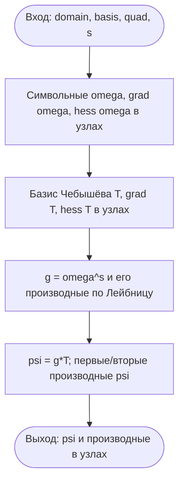
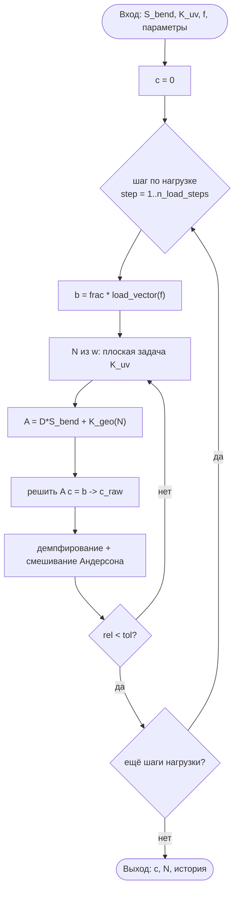
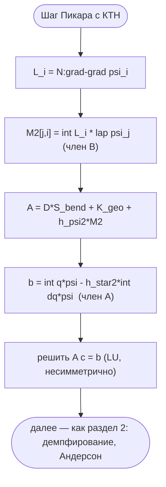
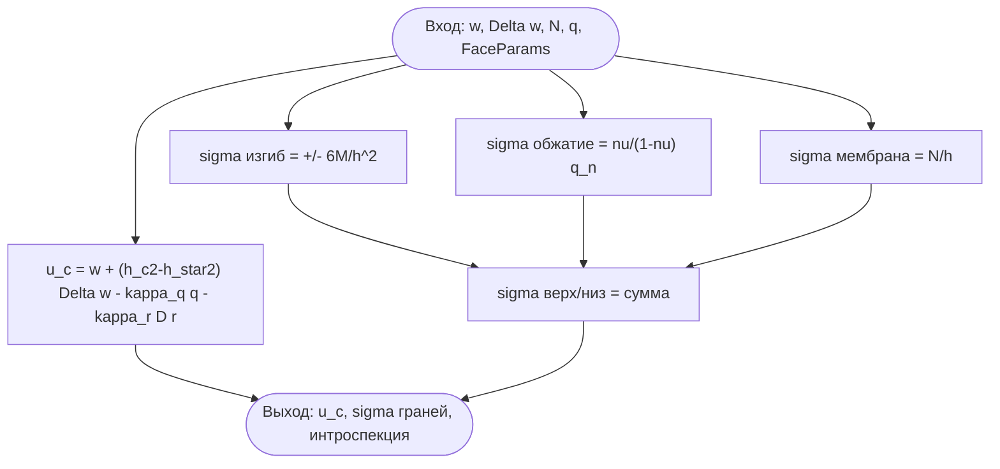
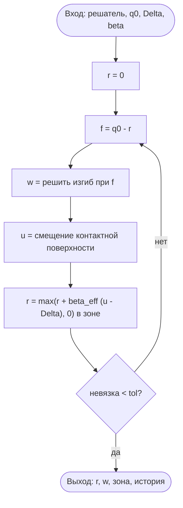

# Формализация алгоритмов (ГОСТ 19.701-90 / UML)

Псевдокод и блок-схемы ключевых алгоритмов комплекса `plate-solver`. Каждый
блок ссылается на конкретную функцию кода; docstring этих функций ссылается
обратно на этот документ. Диаграммы — в текстово-воспроизводимом формате
Mermaid (версионируются, рендерятся на GitHub), а не бинарные картинки.

Обозначения псевдокода: `←` присваивание; `∫…` — квадратура Гаусса–Лежандра
по узлам маски `ω > 0`; матрично-векторные операции — как в NumPy.

Содержание:
1. Сборка RFM-структуры `ω^s·Φ`
2. Итерация Пикара с ускорением Андерсона и шагами по нагрузке (Карман)
3. Добавочные члены КТН (A), (B) во внеплоскостном шаге
4. Постобработка лицевых величин
5. Метод обобщённой реакции (МОР) — односторонний контакт

---

## 1. Сборка RFM-структуры `ω^s·Φ`

Метод R-функций (Рвачёв): краевые условия удовлетворяются ТОЧНО структурой
`w = ω^s·Φ`, где `ω` — нормализованная функция области (`ω > 0` внутри,
`ω = 0` на ∂Ω), `Φ = Σ c_k T_k` — тензорный базис Чебышёва, `s` — порядок
(`s = 2` защемление `w = ∂_n w = 0`; `s = 1` мягкий шарнир `w = 0`).

**Вход:** область `domain` (символьная `ω`), базис `basis` (степень `p`),
квадратура `quad` (узлы `X, Y`, веса `W`), порядок `s`.
**Выход:** `ψ_k` и производные `ψ_{k,x}, ψ_{k,y}, ψ_{k,xx}, ψ_{k,yy}, ψ_{k,xy}`
в узлах квадратуры (`ψ_k = ω^s·T_k`).

```
для каждого узла (x, y) квадратуры:
    ω, ∇ω, ∇∇ω ← символьные производные domain.omega_expr (SymPy → NumPy)
    T_k, ∇T_k, ∇∇T_k ← значения базиса Чебышёва (numpy.polynomial.chebyshev)
g ← ω^s;  производные g по Лейбницу (g_x = s·ω^{s−1}·ω_x, …)
ψ_k     ← g·T_k
ψ_{k,a} ← g_a·T_k + g·T_{k,a}                     # первые производные
ψ_{k,ab}← g_{ab}·T_k + g_a·T_{k,b} + g_b·T_{k,a} + g·T_{k,ab}
```

Реализация: `membrane._w_structure`, `clamped._structure_second_derivs`,
`clamped._OmegaHessian`.



---

## 2. Итерация Пикара (Карман): ускорение Андерсона + шаги по нагрузке

Геометрически-нелинейная задача Кармана решается неподвижной точкой
отображения `T`: по прогибу `w` вычисляются мембранные усилия `N`, при
замороженных `N` решается линейная внеплоскостная задача. Большие прогибы
достигаются наращиванием нагрузки; сходимость ускоряется смешиванием
Андерсона (та же неподвижная точка, сверхлинейная сходимость).

**Вход:** оператор изгиба `S_bend`, мембранная жёсткость `K_uv`
(факторизованы один раз), нагрузка `f`, число шагов `n_load_steps`, окно
Андерсона `m`, релаксация `θ`, порог `tol`, предел итераций.
**Выход:** коэффициенты прогиба `c`, усилия `N`, история сходимости.

```
c ← 0
для step = 1 … n_load_steps:                      # наращивание нагрузки
    b ← (step/n_load_steps) · ∫ f·ψ                # вектор нагрузки уровня
    история_невязок ← []
    повторять до сходимости либо предела итераций:
        w_x, w_y ← ∇w из c                          # шаг Пикара T(c):
        (u, v), N ← решить плоскую задачу K_uv по предвар. деформациям ½|∇w|²
        K_geo(N) ← ∫ N_αβ ψ_{i,α} ψ_{j,β}           # геометрическая жёсткость
        c_raw ← решить (D·S_bend + K_geo)·c = b
        g ← (1−θ)·c + θ·c_raw                        # демпфированный шаг
        c ← смешивание Андерсона по истории {g, g−c} (окно m)
        rel ← ‖Δw‖_L2 / ‖w‖_L2;  выход при rel < tol
```

Реализация: `membrane.KarmanPlate.solve`, `._picard_map`, `._membrane_forces`,
`._geometric_stiffness`. Мат. обоснование сходимости — кандидат в теорему T5
(NOTES.md §22): `T` — сжатие при нагрузке ниже порога.



---

## 3. Добавочные члены КТН (A), (B)

Полная нелинейная КТН = Карман плюс два члена во внеплоскостном уравнении:
`D Δ²w = q_n − h_*²Δq_n + (I − h_ψ²Δ)L(Φ, w)`. Относительно шага Пикара
Кармана (раздел 2) на каждой итерации добавляется член (B) в МАТРИЦУ и член
(A) в вектор нагрузки.

**Вход:** те же, что раздел 2, плюс параметры толщины `h_ψ², h_*²`, вторые
производные структуры `ψ_{,ab}`, лапласиан нагрузки `Δq` (для члена A).
**Выход:** тот же (c, N, история), но с КТН-регуляризацией.

Слабая форма члена (B) БЕЗ 4-х производных (формула Грина, защемление ⇒
граничный член ноль): `−h_ψ²∫v ΔL = −h_ψ²∫L Δv`. При замороженных `N` это
линейно по `w`, поэтому — матрица `M_2[j,i] = ∫(N:∇∇ψ_i)·Δψ_j`.

```
# внутри шага Пикара (раздел 2), при включённых КТН-членах:
L_i     ← N_x·ψ_{i,xx} + 2N_xy·ψ_{i,xy} + N_y·ψ_{i,yy}     # оператор L на структуре
M_2[j,i]← ∫ L_i · (ψ_{j,xx}+ψ_{j,yy}) · W                  # член (B), несимметричен
A       ← D·S_bend + K_geo(N) + h_ψ²·M_2                    # матрица КТН
b       ← ∫ q·ψ − h_*²·∫ Δq·ψ                              # член (A) в нагрузке
c_raw   ← решить A·c = b        (LU с диаг. предобусловливанием — несимметр.)
```

При `h_ψ² = h_*² = 0` члены исчезают ⇒ система тождественно кармановская
(редукция КТН→Карман до машинной точности, Gate R1). Реализация:
`ktn_full.KTNPlate._picard_map`, `._ktn_regularization`, `._load_vector`,
`ktn_full._lin_solve`.



---

## 4. Постобработка лицевых величин

Прогиб лицевой поверхности `u_c` и напряжения на гранях — из сошедшегося
`w, Δw, N, q` и параметров толщины (БЕЗ поля сдвига `ψ`, §3.6). Доступно
любой теории (для classic/karman — тривиальные/мембранные поправки).

**Вход:** прогиб `w`, кривизна `Δw = −(M_x+M_y)/(D(1+ν))`, усилия `N`,
нагрузки граней `q_top, q_bot`, параметры `FaceParams` (h_ψ², h_*², h_c²).
**Выход:** `u_c` (нижняя грань), напряжения `σ` верх/низ (изгиб + обжатие +
мембрана), интроспекция параметров толщины.

```
u_c   ← w + (h_c²−h_*²)·Δw − κ_q·q_n − κ_r·D·r      # прогиб нижней лицевой (κ из ktn_linear)
σ^изг ← ±6M/h²                                       # изгибные (знак: верх/низ)
σ^обж ← ν/(1−ν)·q_n                                  # обжатие (подпись КТН: q_n ≠ 0 по области)
σ^мем ← N/h                                          # мембранные (нелинейные теории)
σ_верх/низ ← σ^изг + σ^обж + σ^мем
```

Реализация: `faces.FaceParams.face_deflection`, `faces.face_stresses`,
`ktn.stresses_faces`. Подпись КТН: член обжатия `h_*²Δw` ненулевой даже под
равномерной нагрузкой (`Δw` меняется по области), тогда как срединный `w` не
меняется (`Δq = 0`).



---

## 5. Метод обобщённой реакции (МОР) — односторонний контакт

Контакт с жёстким основанием (условия Синьорини с зазором `Δ`): реакция `r` в
узлах квадратуры обновляется релаксацией по нарушению зазора, оператор изгиба
факторизован один раз (итерация дёшева).

**Вход:** факторизованный решатель изгиба, нагрузка `q0`, зазор `Δ`, шаг
`β_eff = β/gain`, критерий останова.
**Выход:** реакция `r`, прогиб `w`, зона контакта, история невязок.

```
r ← 0
повторять до сходимости:
    f ← q0 − r                                     # нагрузка в узлах
    w ← решить изгиб при f (две треугольные подстановки)
    u ← смещение контактной поверхности (классика: u = w; КТН: с поправками)
    r ← [r + β_eff·(u − Δ)]₊     в зоне основания   # обновление + проекция r ≥ 0
    невязка ← ‖r − r_prev‖;  выход при < tol
зона контакта ← { r > 0 }
```

Реализация: `contact.ContactMOR.solve`. Условие сходимости (теорема 4):
`0 < β < 2`. Нелинейный контакт (МОР поверх КТН) — направление развития v0.6.0.



---

Разделение труда: этот документ формализует УЖЕ реализованные алгоритмы
(псевдокод + схемы, точно по коду). Доведение до текста (нарратив, ссылки на
литературу, увязка с теоремами T1–T6) — отдельно; `ALGORITHMS.md` служит для
этого исходником.
