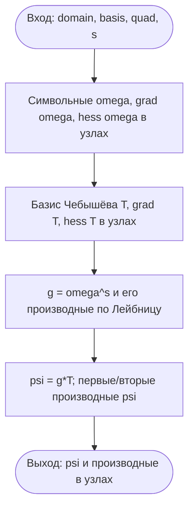
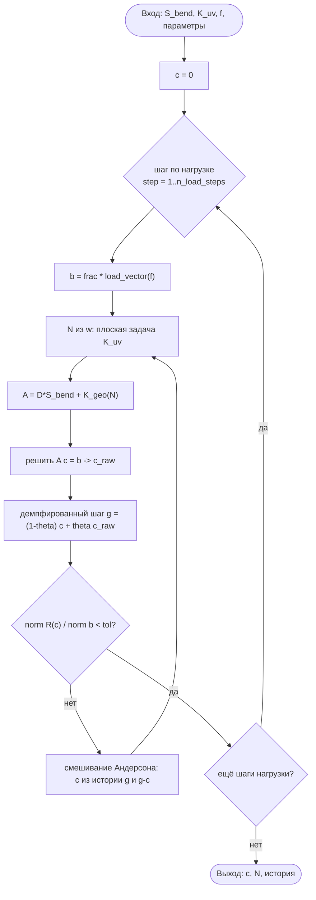
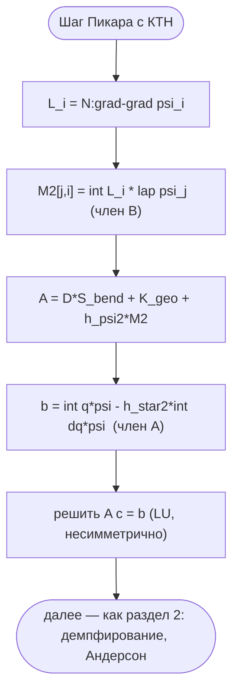
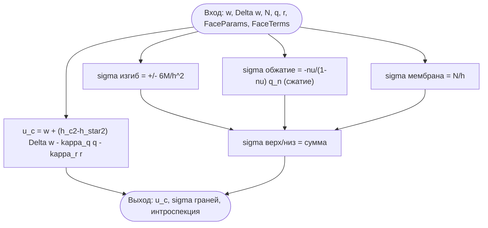
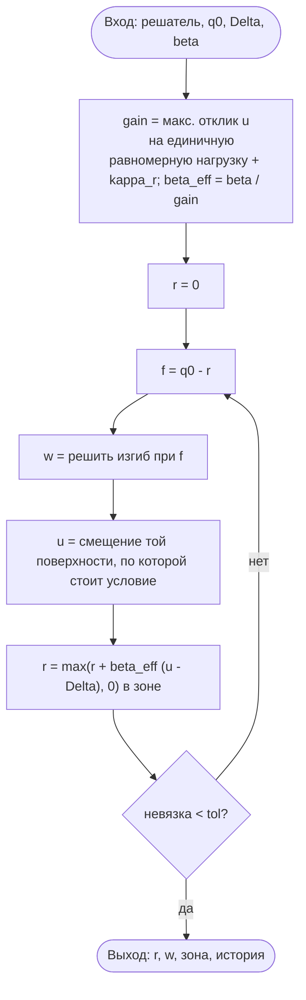

# Формализация алгоритмов (ГОСТ 19.701-90 / UML)

Псевдокод и блок-схемы ключевых алгоритмов комплекса `plate-solver`. Каждый
блок ссылается на конкретную функцию кода; docstring этих функций ссылается
обратно на этот документ. Диаграммы — в текстово-воспроизводимом формате
Mermaid (версионируются, рендерятся на GitHub), а не бинарные картинки.

Обозначения псевдокода: `←` присваивание; `∫…` — квадратура Гаусса–Лежандра
по узлам маски `ω > 0`; матрично-векторные операции — как в NumPy.

Содержание:
1. Сборка RFM-структуры `ω^s·Φ`
2. Итерация Пикара с ускорением Андерсона и шагами по нагрузке (Карман)
3. Добавочные члены КТН (A), (B) во внеплоскостном шаге
4. Постобработка лицевых величин
5. Метод обобщённой реакции (МОР) — односторонний контакт

---

## 1. Сборка RFM-структуры `ω^s·Φ`

Метод R-функций (Рвачёв): краевые условия удовлетворяются ТОЧНО структурой
`w = ω^s·Φ`, где `ω` — нормализованная функция области (`ω > 0` внутри,
`ω = 0` на ∂Ω), `Φ = Σ c_k T_k` — тензорный базис Чебышёва, `s` — порядок
(`s = 2` защемление `w = ∂_n w = 0`; `s = 1` мягкий шарнир `w = 0`).

**Вход:** область `domain` (символьная `ω`), базис `basis` (степень `p`),
квадратура `quad` (узлы `X, Y`, веса `W`), порядок `s`.
**Выход:** `ψ_k` и производные `ψ_{k,x}, ψ_{k,y}, ψ_{k,xx}, ψ_{k,yy}, ψ_{k,xy}`
в узлах квадратуры (`ψ_k = ω^s·T_k`).

```
для каждого узла (x, y) квадратуры:
    ω, ∇ω, ∇∇ω ← символьные производные domain.omega_expr (SymPy → NumPy)
    T_k, ∇T_k, ∇∇T_k ← значения базиса Чебышёва (numpy.polynomial.chebyshev)
g ← ω^s;  производные g по Лейбницу (g_x = s·ω^{s−1}·ω_x, …)
ψ_k     ← g·T_k
ψ_{k,a} ← g_a·T_k + g·T_{k,a}                     # первые производные
ψ_{k,ab}← g_{ab}·T_k + g_a·T_{k,b} + g_b·T_{k,a} + g·T_{k,ab}
```

Реализация: `membrane._w_structure`, `clamped._structure_second_derivs`,
`clamped._OmegaHessian`.


```mermaid
flowchart TD
    A([Вход: domain, basis, quad, s]) --> B[Символьные omega, grad omega, hess omega в узлах]
    B --> C[Базис Чебышёва T, grad T, hess T в узлах]
    C --> D["g = omega^s и его производные по Лейбницу"]
    D --> E["psi = g*T; первые/вторые производные psi"]
    E --> F([Выход: psi и производные в узлах])
```

---

## 2. Итерация Пикара (Карман): ускорение Андерсона + шаги по нагрузке

Геометрически-нелинейная задача Кармана решается неподвижной точкой
отображения `T`: по прогибу `w` вычисляются мембранные усилия `N`, при
замороженных `N` решается линейная внеплоскостная задача. Большие прогибы
достигаются наращиванием нагрузки; сходимость ускоряется смешиванием
Андерсона (та же неподвижная точка, сверхлинейная сходимость).

**Вход:** оператор изгиба `S_bend`, мембранная жёсткость `K_uv`
(факторизованы один раз), нагрузка `f`, число шагов `n_load_steps`, окно
Андерсона `m`, релаксация `θ`, порог `tol`, предел итераций.
**Выход:** коэффициенты прогиба `c`, усилия `N`, история сходимости.

```
c ← 0
b_полн ← ∫ f·ψ                                     # нормировка невязки — по ПОЛНОЙ нагрузке
для step = 1 … n_load_steps:                      # наращивание нагрузки
    b ← (step/n_load_steps) · b_полн               # вектор нагрузки уровня
    повторять до сходимости либо предела итераций:
        w_x, w_y ← ∇w из c                          # шаг Пикара T(c):
        (u, v), N ← решить плоскую задачу K_uv по предвар. деформациям ½|∇w|²
        K_geo(N) ← ∫ N_αβ ψ_{i,α} ψ_{j,β}           # геометрическая жёсткость
        c_raw ← решить (D·S_bend + K_geo)·c = b
        g ← (1−θ)·c + θ·c_raw                        # демпфированный шаг
        R ← (D·S_bend + K_geo(N))·c − b              # ИСТИННАЯ невязка в ТЕКУЩЕЙ точке c
        если ‖R‖/‖b_полн‖ < tol: выход, вернув ИМЕННО c
        c ← смешивание Андерсона по истории {g, g−c} (окно m)
```

Останов — по истинной невязке, а не по норме шага (v0.8.0). После ускорения
Андерсона шаг может стать мал сам по себе, тогда как система ещё далека от
равновесия: прежний критерий поднимал флаг сходимости при относительной
невязке, в сотни раз худшей допуска. Невязка считается ДО смешивания, в той
же точке `c`, где уже собраны усилия `N(c)`, поэтому обходится без лишней
сборки; нормируется она полной нагрузкой, а не текущим уровнем, — тогда
`karman_tol` означает одно и то же на всех уровнях и у обоих методов
(Пикар и Ньютон).

Реализация: `membrane.KarmanPlate.solve`, `._picard_map`, `._membrane_forces`,
`._geometric_stiffness`. Мат. обоснование сходимости — кандидат в теорему T5
(NOTES.md §22): `T` — сжатие при нагрузке ниже порога.


```mermaid
flowchart TD
    A([Вход: S_bend, K_uv, f, параметры]) --> B[c = 0]
    B --> C{шаг по нагрузке<br/>step = 1..n_load_steps}
    C --> D["b = frac * load_vector(f)"]
    D --> E[N из w: плоская задача K_uv]
    E --> F["A = D*S_bend + K_geo(N)"]
    F --> G["решить A c = b -> c_raw"]
    G --> H["демпфированный шаг g = (1-theta) c + theta c_raw"]
    H --> I{"norm R(c) / norm b < tol?"}
    I -- нет --> I2[смешивание Андерсона: c из истории g и g-c]
    I2 --> E
    I -- да --> J{ещё шаги нагрузки?}
    J -- да --> C
    J -- нет --> K([Выход: c, N, история])
```

---

## 3. Добавочные члены КТН (A), (B)

Полная нелинейная КТН = Карман плюс два члена во внеплоскостном уравнении:
`D Δ²w = q_n − h_*²Δq_n + (I − h_ψ²Δ)L(Φ, w)`. Относительно шага Пикара
Кармана (раздел 2) на каждой итерации добавляется член (B) в МАТРИЦУ и член
(A) в вектор нагрузки.

**Вход:** те же, что раздел 2, плюс параметры толщины `h_ψ², h_*²`, вторые
производные структуры `ψ_{,ab}`, лапласиан нагрузки `Δq` (для члена A).
**Выход:** тот же (c, N, история), но с КТН-регуляризацией.

Слабая форма члена (B) БЕЗ 4-х производных (формула Грина): `−h_ψ²∫v ΔL =
−h_ψ²∫L Δv`. При замороженных `N` это линейно по `w`, поэтому — матрица
`M_2[j,i] = ∫(N:∇∇ψ_i)·Δψ_j`. При ЗАЩЕМЛЕНИИ (`v = ∂_n v = 0` на ∂Ω)
граничный интеграл формулы Грина обращается в ноль; на МЯГКОМ ШАРНИРЕ он
ненулевой и собирается отдельно квадратурой по ∂Ω
(`ktn_full._boundary_quad`: полигонная, звёздная или контурная — по типу
области), поэтому мягкий шарнир полной КТН допущен только там, где эта
квадратура точна: `circle | ellipse | rectangle | annulus` (область с
входящим углом — направление развития).

```
# внутри шага Пикара (раздел 2), при включённых КТН-членах:
L_i     ← N_x·ψ_{i,xx} + 2N_xy·ψ_{i,xy} + N_y·ψ_{i,yy}     # оператор L на структуре
M_2[j,i]← ∫ L_i · (ψ_{j,xx}+ψ_{j,yy}) · W                  # член (B), несимметричен
A       ← D·S_bend + K_geo(N) + h_ψ²·M_2                    # матрица КТН
b       ← ∫ q·ψ − h_*²·∫ Δq·ψ                              # член (A) в нагрузке
c_raw   ← решить A·c = b        (LU с диаг. предобусловливанием — несимметр.)
```

При `h_ψ² = h_*² = 0` члены исчезают ⇒ система тождественно кармановская
(редукция КТН→Карман до машинной точности, Gate R1). Реализация:
`ktn_full.KTNPlate._picard_map`, `._ktn_regularization`, `._load_vector`,
`ktn_full._lin_solve`.


```mermaid
flowchart TD
    A([Шаг Пикара с КТН]) --> B["L_i = N:grad-grad psi_i"]
    B --> C["M2[j,i] = int L_i * lap psi_j  (член B)"]
    C --> D["A = D*S_bend + K_geo + h_psi2*M2"]
    D --> E["b = int q*psi - h_star2*int dq*psi  (член A)"]
    E --> F["решить A c = b (LU, несимметрично)"]
    F --> G([далее — как раздел 2: демпфирование, Андерсон])
```

---

## 4. Постобработка лицевых величин

Прогиб лицевой поверхности `u_c` и напряжения на гранях — из сошедшегося
`w, Δw, N, q` и параметров толщины (БЕЗ поля сдвига `ψ`, §3.6). Доступно
любой теории (для classic/karman — тривиальные/мембранные поправки).

**Вход:** прогиб `w`, кривизна `Δw = −(M_x+M_y)/(D(1+ν))`, усилия `N`,
нагрузки граней `q_top, q_bot`, параметры `FaceParams` (h_ψ², h_*², h_c²).
**Выход:** `u_c` (нижняя грань), напряжения `σ` верх/низ (изгиб + обжатие +
мембрана), интроспекция параметров толщины.

```
u_c   ← w + (h_c²−h_*²)·Δw − κ_q·q_n − κ_r·r         # прогиб нижней лицевой (κ из ktn_linear)
σ^изг ← ±6M/h²                                       # изгибные (знак: верх/низ)
σ^обж ← −ν/(1−ν)·q_n                                 # обжатие, СЖАТИЕ (q_n ≠ 0 по области)
σ^мем ← N/h                                          # мембранные (нелинейные теории)
σ_верх/низ ← σ^изг + σ^обж + σ^мем
```

Реализация: `faces.FaceParams.face_deflection`, `faces.face_stresses`,
`ktn.stresses_faces`. Подпись уточнённой теории проходит по РАЗНЫМ величинам:
в КИНЕМАТИКЕ это кривизный член `c_curv·Δw` лицевого прогиба (ненулевой даже
под равномерной нагрузкой, потому что `Δw` меняется по области, тогда как
срединный `w` под ней не меняется: `Δq = 0`), а в НАПРЯЖЕНИЯХ — член
поперечного обжатия `−ν/(1−ν)·q_n`, который различает грани, потому что на
верхней стоит внешняя нагрузка, а на нижней — реакция основания. Члена
`h_*²Δw` в напряжениях НЕТ.

Две поправки v0.8.0, изменившие эти формулы.

* **Размерность члена реакции.** Коэффициенты `κ_q`, `κ_r` — ПОДАТЛИВОСТИ
  [м/Па], поэтому лицевую длину дают произведения `κ_q·q_n` и `κ_r·r`.
  Прежний множитель `D` (`κ_r·D·r`) давал величину размерности Па·м⁴ и делал
  модель зависимой от системы единиц: классика при масштабировании (E, q₀)
  воспроизводилась бит-в-бит, а лицевое условие менялось качественно.
* **Знак члена обжатия.** Давление `q_n ≥ 0` — не `σ_z`: на нагруженной грани
  `σ_z = −q_n`, откуда вклад `−ν/(1−ν)·q_n`, то есть СЖАТИЕ. Со знаком «+»
  давление давало растяжение.

Каждое из трёх слагаемых лицевого прогиба (кривизна, нагрузка, реакция)
включается по отдельности переключателями `faces.FaceTerms` (ключи
`[model.face_terms]`) — тем же трактом решателя, без ветвления арифметики
на штатном пути «включено всё».


```mermaid
flowchart TD
    A([Вход: w, Delta w, N, q, r, FaceParams, FaceTerms]) --> B["u_c = w + (h_c2-h_star2) Delta w - kappa_q q - kappa_r r"]
    A --> C["sigma изгиб = +/- 6M/h^2"]
    A --> D["sigma обжатие = -nu/(1-nu) q_n (сжатие)"]
    A --> E["sigma мембрана = N/h"]
    C --> F[sigma верх/низ = сумма]
    D --> F
    E --> F
    B --> G([Выход: u_c, sigma граней, интроспекция])
    F --> G
```

---

## 5. Метод обобщённой реакции (МОР) — односторонний контакт

Контакт с жёстким основанием (условия Синьорини с зазором `Δ`): реакция `r` в
узлах квадратуры обновляется релаксацией по нарушению зазора, оператор изгиба
факторизован один раз (итерация дёшева).

**Вход:** факторизованный решатель изгиба, нагрузка `q0`, зазор `Δ`, шаг
`β_eff = β/gain`, критерий останова.
**Выход:** реакция `r`, прогиб `w`, зона контакта, история невязок.

```
gain ← max|u(единичная равномерная нагрузка)| + κ_r      # оценка ‖G‖, см. ниже
β_eff ← β / gain
r ← 0
повторять до сходимости:
    f ← q0 − r                                     # нагрузка в узлах
    w ← решить изгиб при f (две треугольные подстановки)
    u ← смещение контактной поверхности (классика: u = w; уточнённая: u = u_c)
    r ← [r + β_eff·(u − Δ)]₊     в зоне основания   # обновление + проекция r ≥ 0
    невязка ← ‖r − r_prev‖;  выход при < tol
зона контакта ← { r > 0 }
```

Нормировка шага (v0.8.0) берётся по ТОЙ ЖЕ поверхности, по которой стоит
условие непроникания: отклик `u` на единичную равномерную нагрузку плюс
диагональная податливость `κ_r`. В теорему 4 входит полный оператор
`r ↦ u_c(r)`, а не одна его изгибная часть; при оценке по срединному прогибу
шаг на толстой пластине выходил за границу сходимости, и итерация
2-циклилась к `r ≡ 0`. В классике `κ_r = 0` и `u = w` — числа прежние
бит-в-бит.

Реализация: `contact.ContactMOR.solve`. Условие сходимости (теорема 4):
`0 < β < 2`. Нелинейный контакт (МОР поверх КТН) — раздел 6 (v0.6.0).


```mermaid
flowchart TD
    A([Вход: решатель, q0, Delta, beta]) --> A2["gain = макс. отклик u
    на единичную равномерную нагрузку + kappa_r; beta_eff = beta / gain"]
    A2 --> B[r = 0]
    B --> C["f = q0 - r"]
    C --> D[w = решить изгиб при f]
    D --> E["u = смещение той поверхности, по которой стоит условие"]
    E --> F["r = max(r + beta_eff (u - Delta), 0) в зоне"]
    F --> G{невязка < tol?}
    G -- нет --> C
    G -- да --> H([Выход: r, w, зона, история])
```

## 6. Нелинейный контакт МОР+КТН (совмещённая схема, v0.6.0)

Метод обобщённой реакции ВОКРУГ полного нелинейного решателя КТН: два
итерационных процесса — внешний МОР по реакции `r` и внутренний Пикар по
мембранному полю `N` (КТН-члены). Контакт «щупает» ЛИЦЕВУЮ поверхность —
ПОЛНОЕ лицевое условие раздела 4: `u_c = w + (h_c²−h_*²)Δw − κ_q·q⁺ − κ_r·r`
(v0.8.0: прежде в нелинейном тракте стоял один кривизный член, и величина,
по которой МОР держал непроникание, расходилась с экспортируемой `w_bot`).
Все три коэффициента масштабируются теорией: у `classic` и `karman` они
нули по построению ⇒ `u_c = w`, контакт по срединной поверхности.

Две схемы композиции (`contact_nl.NonlinearContactMOR`, §4 ТЗ):

* **вложенная** (`scheme="nested"`, ЭТАЛОН): на каждом шаге МОР — полный сходящийся
  Пикар; проста, надёжна, дорога;
* **совмещённая** (`scheme="merged"`, рабочая, T7): ОДИН шаг Пикара на ОДИН шаг
  МОР с общей недорелаксацией `θ` — быстрее в разы.

**Вход:** решатель КТН (пресет теории), нагрузка `q0`, зазор/препятствие `z`,
шаг `β_eff = β/gain`, недорелаксация `θ`, критерий останова.
**Выход:** реакция `r`, прогибы `w`/`u_c`, зона и топология контакта, история.

Усиление `gain` — свойство ОПЕРАТОРА, поэтому отклик берётся на РАВНОМЕРНУЮ
опорную нагрузку амплитуды `|q0|` (v0.8.0), а не на фактическое поле: для
узкой гауссианы отклик мал, и нормировка «по полю» занижала ‖G‖ в разы ⇒
`β_eff·‖G‖ ≈ 8` и расходимость к `r ≡ 0` при вполне валидной постановке.
Отклик снимается по лицевой поверхности и дополняется диагональю `κ_r` —
той же величиной, по которой ставится условие Синьорини. Ключ `gain_mode`
выбирает, ЧЕЙ это отклик:

* `secant` (по умолчанию) — секущая податливость нелинейного решения
  `gain = w_free/q0` в рабочей точке;
* `linear` — линейная податливость `gain = w_max_classic/q0` (Кирхгоф,
  `N = 0`). При неподвижной кромке `K_geo(N) ⪰ 0`, поэтому `w_nl ≤ w_lin`, и
  линейная податливость — ВЕРХНЯЯ грань ‖G‖ вдоль всего пути итерации
  (равномерное сжатие T4). Нужна при `w_lin/w_free ≫ 1`, где секущая
  занижает ‖G‖ у контактного состояния; плата — больше итераций.

```
c ← c_free                                         # тёплый старт: свободное решение КТН
r ← 0
повторять до сходимости (совмещённая схема):
    b ← вектор нагрузки при (q0 − r)               # член A: −h_*²Δq (при неравн. нагрузке)
    c ← (1−θ)·c + θ·[D·S_bend + K_geo(N) + h_ψ²·M2(N)]⁻¹ b    # ОДИН шаг Пикара (КТН)
    u_c ← w(c) + (h_c²−h_*²)·Δw(c) − κ_q·q⁺ − κ_r·r    # полное лицевое условие
    r ← [r + β_eff·(u_c − z)]₊  в зоне основания    # обновление МОР + проекция r ≥ 0
    невязка ← max(‖Δr‖/‖r‖, ‖Δw‖/‖w‖); выход при < tol   # совместная сходимость
зона контакта ← { r > 0 };  число пятен ← связные компоненты (diagnostics)
```

Сходимость (теорема T7): совмещённое отображение — композиция сжатий МОР (T4) и
Пикара (T5); при малости нагрузки/зазора произведение констант < 1. Гейт R4:
совмещённая схема совпадает с вложенной до допуска МОР. Редукции точны по
единой модели: контакт выкл (`r≡0`) → свободная КТН; уточнение выкл (`α→0`) →
кармановский контакт (`u_c = w`). Реализация: `contact_nl.py`.

**Диагностика зоны** — `diagnostics.py`: размер, пик, сила, число связных
пятен и статистика внутренности. Компоненты размечаются по РЕШЁТКЕ
квадратуры 4-связностью (v0.8.0): порог «1.8·медиана шага» на графе близости
определялся сгущением узлов Гаусса у кромок описанного прямоугольника и рвал
одно пятно на десятки «компонент» (граф близости оставлен запасным путём для
нерегулярных наборов точек). `contact_interior_stats` отделяет глубину зоны
от кромочной полосы по расстоянию до ближайшего неконтактного узла и
показывает плато `r/q ≈ 1` — то, чего не видно по одному пику.

**Многосвязные области** (кольцо, пластина с отверстием): граница задаётся
R-операциями Рвачёва над примитивами — `ω = ω_внеш ∧ (¬ω_отв)` (пересечение с
дополнением выреза, СИМВОЛЬНЫЕ `r_and`/`r_diff` в `geometry.py`); структура
`w = ω^s·Φ` удовлетворяет ГУ на ВСЕХ компонентах границы автоматически.
Решатели теорий и контакт работают без изменений — многосвязность целиком в
геометрии.

---

Разделение труда: этот документ формализует УЖЕ реализованные алгоритмы
(псевдокод + схемы, точно по коду). Доведение до текста (нарратив, ссылки на
литературу, увязка с теоремами T1–T7) — отдельно; `ALGORITHMS.md` служит для
этого исходником.
