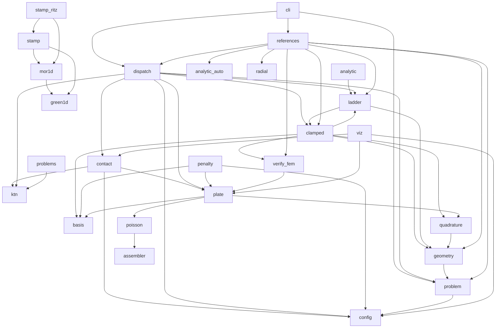

# Архитектура

Обнародованный результат: [github.com/AnatoDu/plate-solver](https://github.com/AnatoDu/plate-solver),
архивная запись Zenodo (постоянный идентификатор проекта, concept DOI):
[10.5281/zenodo.21218627](https://doi.org/10.5281/zenodo.21218627).

## Слои (направление зависимостей — сверху вниз)

1. **Постановка и CLI** — `problem` (валидатор case-файлов, `CaseError`),
   `cli` (plate-solve / plate-verify / plate-ladder), `references`
   (верификация как свойство постановки).
2. **Диспетчер** — `dispatch`: `solve(problem) → Result`; маршрутизация
   по решателям (блок-схема — [dispatch_flow.md](dispatch_flow.md)).
3. **Контакт** — `contact` (МОР: `ContactMOR`, `TwoPlateMOR`), `ktn`
   (поправки уточнённой теории; напряжения лицевых поверхностей).
4. **Решатели изгиба** — `plate` (расщепление, мягкий шарнир), `clamped`
   (прямой Ритц, защемление; `MixedRectPlate` — смешанные КУ и свободный
   край), `poisson` (кирпич расщепления), `radial` (1D по радиусу).
5. **Геометрия и дискретизация** — `geometry` (R-функции, система R0),
   `basis` (Чебышёв), `quadrature` (гауссова квадратура с маской ω > 0),
   `assembler`.
6. **Эталоны** — `analytic` (ручные замкнутые решения), `analytic_auto`
   (фабрика с самосертификацией), `ladder` (верификационная лестница,
   MMS), `verify_fem` (независимый МКЭ, scikit-fem), `config`.
7. **Вывод** — `viz` (фигуры, `replot` из fields.npz).
8. **1D-задел** — `green1d`, `mor1d`, `stamp`, `stamp_ritz`,
   `strip_contact`, `penalty`, `problems` (историческое ядро 1D-контакта
   и сравнений; используется эталонными воротами).

## Граф импортов (фактический; генератор — scripts/import_graph.py)

Часть рёбер — ленивые импорты внутри функций (тяжёлые зависимости:
matplotlib в `viz`, scikit-fem в `verify_fem`, sympy-фабрика в
`references`); пакет загружается и без них.

## Принцип «плоский пакет + фасад»

Пакет НАМЕРЕННО плоский (22 модуля в `src/plate_solver/`): стабильность
листинга исходного текста к регистрации, короткие ссылки из документации
(NOTES/THEORY ссылаются на имена файлов), обозримость для стороннего
читателя. «Нелоскость» достигается фасадом: `__init__.py` экспортирует
публичные точки секциями (геометрия / решатели / контакт / верификация /
ввод-вывод / графика), а навигацией служит граф выше и docs/API.md.
Физическая перегруппировка по подпакетам сознательно отложена (вне
freeze): она бы поменяла все ссылки без выигрыша в ясности.

## Как устроен регресс (для стороннего читателя)

Три пояса защиты:

1. **Реестр случаев = ворота.** Каждый файл `cases/ci/*.toml`
   автоматически становится CI-тестом (`tests/test_ci_cases.py`,
   `plate-verify` exit 0); тяжёлые ступени — `cases/ladder/*.toml`
   (маркер `big`). Допуски заморожены протоколом «потолок задан → факт
   × 3» с диагнозом природы ошибки в комментарии case-файла.
2. **Эталонный отчёт под хеш-воротами.** Единый прогон
   (`scripts/run_reference.py`, см. README) порождает отчёт с ключевыми
   числами; файл заморожен SHA-256 — любое изменение чисел = красный
   тест, а не тихое обновление. Обновление отчёта — только осознанным
   коммитом с обоснованием в CHANGELOG.
3. **Регресс-снимки.** `cases/baselines.json` — информационные снимки
   (профили, топология зон, свипы) с кросс-платформенными допусками;
   каждая запись самодокументирована.

Плюс независимые пояса корректности: аналитика (в т.ч. фабрика с
самосертификацией — эталона без проверенного сертификата не существует),
MMS, независимый МКЭ, 1D↔2D-сверка на осесимметрии, sympy-тождества
формул (NOTES §19–21).

## Роли эталонов

| Эталон | Что проверяет | Где |
|---|---|---|
| analytic | модельно-согласованные замкнутые решения; фабрика покрывает канонику автоматически | `analytic`, `analytic_auto` |
| mms | метод на изготовленном решении той же дискретизацией | `ladder` |
| fem | независимая дискретизация (Морли/Аргирис/P2) | `verify_fem` |
| cross_1d | осесимметрия: 1D-Ритц по радиусу | `radial` |
| golden/reference | воспроизводимость всей серии одним прогоном | `scripts/` |
