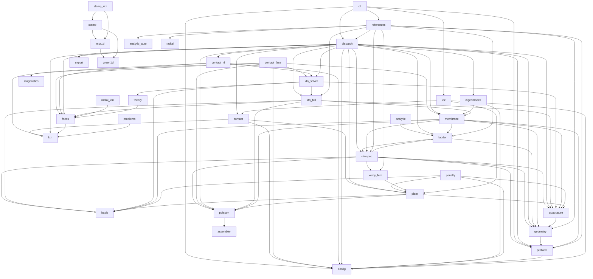

# Архитектура

Обнародованный результат: [github.com/AnatoDu/plate-solver](https://github.com/AnatoDu/plate-solver),
архивная запись Zenodo (постоянный идентификатор проекта, concept DOI):
[10.5281/zenodo.21218627](https://doi.org/10.5281/zenodo.21218627).

## Слои (направление зависимостей — сверху вниз)

1. **Постановка и CLI** — `problem` (валидатор case-файлов, `CaseError`),
   `cli` — ПЯТЬ команд: `plate-solve` (решение case-файла; `--new` — шаблон,
   `--check` — только валидация, `--sweep` — серия по параметру),
   `plate-verify` (таблица эталонов, код возврата 0/1), `plate-ladder`
   (каталог случаев → сводный отчёт), `plate-replot` (перерисовка фигур из
   `fields.npz` без пересчёта), `plate-profile` (профиль поля вдоль сечения,
   наложение результатов, выгрузка CSV); `references` (верификация как
   свойство постановки: именованные эталоны плюс ворота инвариантов
   контакта).
2. **Диспетчер** — `dispatch`: `solve(problem) → Result`; маршрутизация
   по решателям и теориям (блок-схема — [dispatch_flow.md](dispatch_flow.md)).
3. **Контакт** — `contact` (линейный МОР: `ContactMOR`, `TwoPlateMOR` над
   classic/КТН-поправками), `contact_nl` (НЕЛИНЕЙНЫЙ контакт МОР поверх
   полной КТН: `NonlinearContactMOR`, `NonlinearTwoPlateMOR`; схемы
   nested|merged, выбор нормировки шага `gain_mode`), `diagnostics`
   (размер, топология и сила зоны контакта), `contact_face`
   (ЭКСПЕРИМЕНТАЛЬНЫЙ задел: лицевое условие Синьорини на самостоятельном
   поле лицевого прогиба; вне публичного фасада, API нестабилен).
4. **Единая модель теорий** — `theory` (`TheoryParams`; пресеты
   `classic`/`karman`/`ktn_linear`/`ktn_full`; морфинг уточнения),
   `ktn_solver` (`KTNSolver` — ОДИН решатель для всех пресетов, редукции
   точны по построению), `ktn` (линейные поправки сдвига/обжатия,
   напряжения лицевых поверхностей), `ktn_full` (полная нелинейная КТН),
   `membrane` (геометрическая нелинейность Кармана), `faces` (лицевые
   величины первым классом).
5. **Решатели изгиба (ядро)** — `plate` (расщепление, мягкий шарнир),
   `clamped` (прямой Ритц, защемление; `MixedRectPlate` — смешанные КУ и
   свободный край), `poisson` (кирпич расщепления; каскад факторизации
   `SPDFactorization`), `radial` (1D по радиусу, осесимметрия),
   `eigenmodes` (собственные задачи: `buckling` — устойчивость,
   `natural_frequencies` — колебания, обе — и вокруг преднапряжённого
   кармановского состояния).
6. **Геометрия и дискретизация** — `geometry` (система R0: СИМВОЛЬНЫЕ
   R-операции `r_and`/`r_or`/`r_not`/`r_diff` над sympy-выражениями ω,
   примитивы и реестр областей; ими же строится многосвязность),
   `basis` (Чебышёв), `quadrature` (гауссова квадратура с маской ω > 0),
   `assembler`.
7. **Эталоны и верификация** — `analytic` (ручные замкнутые решения),
   `analytic_auto` (фабрика с самосертификацией), `benchmarks`
   (кармановские эталоны Hencky/Way/Levy), `ladder` (верификационная
   лестница, MMS, ряды Навье/Лехницкого), `verify_fem` (независимый МКЭ,
   scikit-fem), `radial_ktn` (1D-оракул полной КТН, Gate R3),
   `fd_contact` (конечно-разностный метод-дублёр контакта, v0.7.0),
   `config`; `exprfield` (v0.7.0) — безопасные выражения f(x, y)
   case-схемы (токен-ограда перед sympy; обслуживает problem/dispatch).
8. **Вывод** — `viz` (фигуры, `replot` из fields.npz), `export`
   (результирующие усилия и запись сеточных полей в LEGACY-VTK).
9. **1D-задел** — `green1d`, `mor1d`, `stamp`, `stamp_ritz`,
   `strip_contact`, `penalty`, `problems` (историческое ядро 1D-контакта
   и сравнений; используется эталонными воротами).

**Где на самом деле живут R-операции.** Областями заведует `geometry`:
ω собирается СИМВОЛЬНО (sympy), потому что структуре Ритца нужны точные
`∇ω` и `∇∇ω`, а не конечные разности. Модуль `rfunctions` — ЧИСЛЕННЫЙ
(numpy) дубль тех же операций системы R0 с ДРУГИМИ именами и сигнатурами:
`r_conjunction` / `r_disjunction` / `difference` плюс отдельные примитивы.
Ни одна ветка решателя его не импортирует (см. граф ниже); он остаётся
ради примера `examples/circular_plate.py` и собственного теста
`tests/test_rfunctions.py`. Как дублирующий — кандидат на депрекацию
с переводом примера на `geometry`; до тех пор при чтении кода помнить,
что `r_and`/`r_or`/`r_diff` — это `geometry`, а не `rfunctions`.

## Граф импортов (фактический; генератор — scripts/import_graph.py)

```mermaid
flowchart TD
    analytic --> ladder
    clamped --> basis
    clamped --> geometry
    clamped --> ladder
    clamped --> poisson
    clamped --> problem
    clamped --> quadrature
    clamped --> verify_fem
    cli --> config
    cli --> dispatch
    cli --> problem
    cli --> references
    cli --> viz
    contact --> config
    contact --> ktn
    contact --> plate
    contact_face --> config
    contact_face --> faces
    contact_face --> ktn
    contact_face --> ktn_solver
    contact_face --> membrane
    contact_face --> poisson
    contact_nl --> config
    contact_nl --> diagnostics
    contact_nl --> faces
    contact_nl --> ktn_solver
    dispatch --> clamped
    dispatch --> config
    dispatch --> contact
    dispatch --> contact_nl
    dispatch --> eigenmodes
    dispatch --> export
    dispatch --> faces
    dispatch --> geometry
    dispatch --> ktn
    dispatch --> ktn_full
    dispatch --> ktn_solver
    dispatch --> ladder
    dispatch --> membrane
    dispatch --> plate
    dispatch --> poisson
    dispatch --> problem
    dispatch --> quadrature
    eigenmodes --> config
    eigenmodes --> membrane
    faces --> ktn
    geometry --> problem
    ktn_full --> basis
    ktn_full --> faces
    ktn_full --> membrane
    ktn_full --> poisson
    ktn_full --> quadrature
    ktn_solver --> basis
    ktn_solver --> ktn_full
    ktn_solver --> quadrature
    ktn_solver --> theory
    ladder --> clamped
    ladder --> geometry
    membrane --> basis
    membrane --> clamped
    membrane --> geometry
    membrane --> ladder
    membrane --> poisson
    membrane --> problem
    membrane --> quadrature
    mor1d --> green1d
    penalty --> basis
    penalty --> config
    penalty --> plate
    penalty --> quadrature
    plate --> basis
    plate --> poisson
    plate --> quadrature
    poisson --> assembler
    problem --> config
    problems --> ktn
    quadrature --> geometry
    radial_ktn --> faces
    references --> analytic_auto
    references --> clamped
    references --> dispatch
    references --> geometry
    references --> ktn_full
    references --> ladder
    references --> problem
    references --> radial
    references --> verify_fem
    stamp --> green1d
    stamp --> mor1d
    stamp_ritz --> mor1d
    stamp_ritz --> stamp
    theory --> faces
    verify_fem --> plate
    viz --> config
    viz --> contact
    viz --> plate
```

Часть рёбер — ленивые импорты внутри функций (тяжёлые зависимости:
matplotlib в `viz`, scikit-fem в `verify_fem`, sympy-фабрика в
`references`); пакет загружается и без них.

## Принцип «плоский пакет + фасад»

Пакет НАМЕРЕННО плоский (42 модуля в `src/plate_solver/`): стабильность
листинга исходного текста к регистрации, короткие ссылки из документации
(NOTES/THEORY ссылаются на имена файлов), обозримость для стороннего
читателя. «Нелоскость» достигается фасадом: `__init__.py` экспортирует
публичные точки секциями (геометрия / решатели / контакт / верификация /
ввод-вывод / графика), а навигацией служит граф выше и docs/API.md.
Физическая перегруппировка по подпакетам сознательно отложена: она бы
поменяла все ссылки без выигрыша в ясности.

## Честность расчёта: где решатель обязан сознаться (v0.8.0)

Отдельный сквозной пояс — не «правильность числа», а ОТЧЁТНОСТЬ: ни одна
деградация и ни одна непроверенная постановка не должны проходить молча.

1. **Каскад факторизации** — `poisson.SPDFactorization`. Ступени включаются
   только при отказе предыдущей: Холецкий (штатный путь, арифметика
   бит-в-бит прежняя) → симметричное масштабирование Якоби → спектральное
   псевдообращение с относительной отсечкой `λ ≤ τ·λ_max`. Третья ступень
   МЕНЯЕТ дискретное пространство (решается усечённая задача), поэтому факт
   усечения обязан быть виден: издаётся `poisson.FactorizationWarning`
   (отдельная категория, а не голый `RuntimeWarning`), решатель несёт
   `fallback` и `n_dropped`, а `dispatch.solve` перехватывает такие
   предупреждения и переносит их текст в `Result.warnings` — не подавляя.
2. **Ворота инвариантов контакта** — `references.contact_invariant_rows`.
   Проверяется то, что верно при любом бюджете итераций: `r ≥ 0`,
   проникание `max(u − Δ)₊/Δ ≤ 5 %`, существование контакта при
   `w_free > Δ`, а в силовом режиме — замыкание `|∫r − P|/P ≤ 2 %`.
   Строки добавляются к отчёту `verify_result` ВСЕГДА, когда в результате
   есть контакт, поэтому постановка с `reference = "none"` больше не
   проходит верификацию, не проверив ничего. Невязка комплементарности и
   флаг сходимости МОР выводятся информационно (зависят от бюджета).
3. **Ограда разрешения** — `dispatch._check_resolution`: узлов квадратуры
   внутри Ω должно быть не меньше числа базисных функций: `M < N` —
   ошибка, `M < 2N` — предупреждение (интегралы грубы). Иначе система
   недоопределена, и решение — произвольный элемент ядра.
4. **Лестница слагаемых лицевого условия** — `faces.FaceTerms` (ключи
   `[model.face_terms]`): кривизна, нагрузка и реакция включаются ПО
   ОТДЕЛЬНОСТИ в одном и том же тракте решателя, что и позволяет измерить
   вклад каждого механизма. Все три включены по умолчанию (арифметика
   штатная); все выключены — лицевая совпадает со срединной.
5. **Диагностика внутренности зоны контакта** —
   `diagnostics.contact_interior_stats`: узлы глубины зоны отделяются от
   кромочных по расстоянию до ближайшего неконтактного узла, и по ним
   считается плато `r/q ≈ 1` (среднее, разброс, доля в полосе) и
   максимальная глубина зоны. Это отличает физическое плато от кромочной
   сингулярности, которую видно по одному лишь пику.

## Как устроен регресс (для стороннего читателя)

Три пояса защиты:

1. **Реестр случаев = ворота.** Каждый файл `cases/ci/*.toml`
   автоматически становится CI-тестом (`tests/test_ci_cases.py`,
   `plate-verify` exit 0); тяжёлые ступени — `cases/ladder/*.toml`
   (маркер `big`). Допуски заморожены протоколом «потолок задан → факт
   × 3» с диагнозом природы ошибки в комментарии case-файла.
2. **Эталонный отчёт под хеш-воротами.** Единый прогон
   (`scripts/run_reference.py`, см. README) порождает отчёт с ключевыми
   числами; файл заморожен SHA-256 — любое изменение чисел = красный
   тест, а не тихое обновление. Обновление отчёта — только осознанным
   коммитом с обоснованием в CHANGELOG.
3. **Регресс-снимки.** `cases/baselines.json` — информационные снимки
   (профили, топология зон, свипы) с кросс-платформенными допусками;
   каждая запись самодокументирована.

Плюс независимые пояса корректности: аналитика (в т.ч. фабрика с
самосертификацией — эталона без проверенного сертификата не существует),
MMS, независимый МКЭ, 1D↔2D-сверка на осесимметрии, sympy-тождества
формул (NOTES §19–21).

## Роли эталонов

| Эталон | Что проверяет | Где |
|---|---|---|
| analytic | модельно-согласованные замкнутые решения; фабрика покрывает канонику автоматически | `analytic`, `analytic_auto` |
| mms | метод на изготовленном решении той же дискретизацией | `ladder` |
| fem | независимая дискретизация (Морли/Аргирис/P2) | `verify_fem` |
| cross_1d | осесимметрия: 1D-Ритц по радиусу | `radial` |
| golden/reference | воспроизводимость всей серии одним прогоном | `scripts/` |
