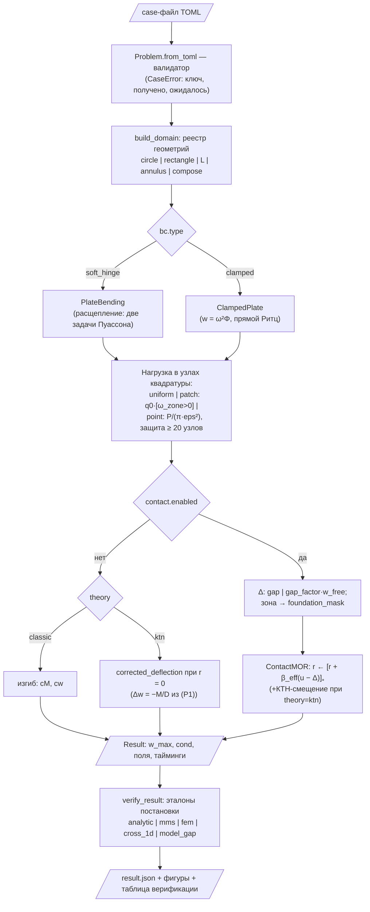

# Блок-схема диспетчера

Схема маршрутизации `dispatch.solve(problem)` (обозначения по
ГОСТ 19.701-90: параллелограмм — данные, ромб — решение, прямоугольник —
процесс). Растровая версия: [dispatch_flow.png](dispatch_flow.png)
(генерируется `python docs/make_dispatch_flow.py`).



## Листинг: annulus_clamped.toml

```toml
[geometry]
kind = "annulus"
a = 1.0
b = 0.4

[bc]
type = "clamped"

[load]
type = "uniform"
q0 = 4.0

[model]
h = 0.06

[discretization]
p = 10
Q = 1024

[verify]
reference = "analytic"   # w(r) = qr⁴/64D + C₁ + C₂r² + C₃ln(r/a) + C₄r²ln(r/a)
cross_1d = true          # 1D-Ритц по радиусу, структура ω²Φ, ω=(a−r)(r−b)
tol = 4.9e-3             # заморожено протоколом «потолок → факт × 3»
```

## Листинг: circle_point_soft.toml

```toml
[geometry]
kind = "circle"
a = 1.0

[bc]
type = "soft_hinge"

[load]
type = "point"           # регуляризованный patch: q = P/(π·eps²)
P = 1.0
x0 = 0.0
y0 = 0.0
eps = 0.025

[model]
h = 0.06

[discretization]
p = 16                   # w ~ r²ln r: полиномы сходятся алгебраически (NOTES §18)
Q = 1024

[verify]
reference = "analytic"   # w(0) = P a²/(8πD) — предел ν→1 формулы Тимошенко
tol = 3.2e-2
```
