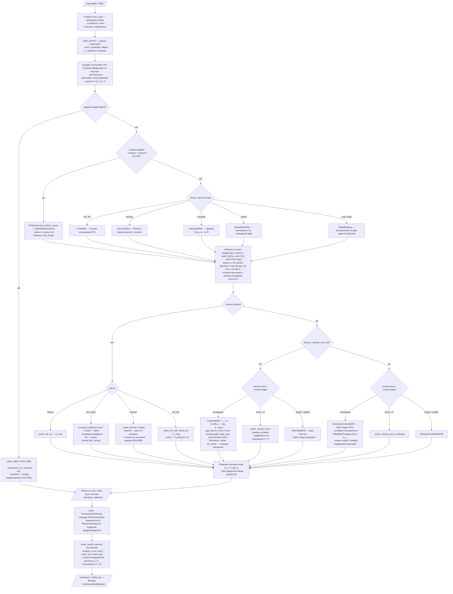

# Блок-схема диспетчера

Схема маршрутизации `dispatch.solve(problem)` (обозначения по
ГОСТ 19.701-90: параллелограмм — данные, ромб — решение, прямоугольник —
процесс). ИСТОЧНИК ИСТИНЫ — исходный текст `src/plate_solver/dispatch.py`
(функции `solve`, `_solve_routed`, `_solve_bending`, `_solve_contact`);
схема ниже выверена по нему построчно и версионируется как текст.

Растровая версия [dispatch_flow.png](dispatch_flow.png) генерируется
`python docs/make_dispatch_flow.py` и пересобрана под маршрутизацию v0.8.0
(эллипс, смешанные краевые условия, собственные задачи, нелинейный контакт,
точечные опоры; ветка теории — действующие имена). Файл двоичный, поэтому
источником истины остаётся mermaid-схема ниже: при правке маршрутизации
правится она, а PNG пересобирается генератором.

## Маршрут


```mermaid
flowchart TD
    A[/case-файл TOML/] --> B["Problem.from_toml — валидатор схемы
    (CaseError: ключ, получено, ожидалось)"]
    B --> C["build_domain — реестр геометрий:
    circle | rectangle | ellipse | L | annulus | compose"]
    C --> D["Ограды постановки: M ≥ N (узлов квадратуры не меньше,
    чем базисных функций); точки [supports] внутри Ω; h(x, y) > 0"]
    D --> E{"задана секция [eigen]?"}
    E -- да --> F["_solve_eigen: linear_plate →
    buckling (λ_cr) | vibration (ω);
    prestress — вокруг кармановского поля N(w)"]
    E -- нет --> G{"contact.enabled
    и theory = karman | ktn_full?"}
    G -- да --> H["KTNSolver.from_theory_name — ЕДИНЫЙ решатель
    (пресет теории; bc = clamped | soft_hinge)"]
    G -- нет --> I{"theory, затем bc.type"}
    I -- ktn_full --> J["KTNPlate — полная нелинейная КТН"]
    I -- karman --> K["KarmanPlate — Фёппль–Карман (picard | newton)"]
    I -- clamped --> L["ClampedPlate — прямой Ритц, w = ω²Φ"]
    I -- mixed --> M["MixedRectPlate — смешанные КУ, свободный край"]
    I -- soft_hinge --> N["PlateBending — расщепление на две задачи Пуассона"]
    H --> O["Нагрузка в узлах квадратуры: uniform | patch (q0·[ω_zone>0]) |
    point (P/(π·eps²), защита ≥ 20 узлов) | gaussian | expr (q0·g(x, y));
    line и точная δ — готовым вектором b, минуя площадную плотность"]
    J --> O
    K --> O
    L --> O
    M --> O
    N --> O
    F --> AF
    O --> P{contact.enabled}
    P -- нет --> Q{theory}
    Q -- classic --> R["изгиб: cM, cw → w_max"]
    Q -- ktn_linear --> S["corrected_deflection при r = 0 (Δw = −M/D);
    слагаемые формулы (9) — ключи [model.face_terms]"]
    Q -- karman --> T["_solve_karman: Пикар/Ньютон + шаги по нагрузке;
    останов по истинной невязке ‖R(c)‖/‖b‖"]
    Q -- ktn_full --> U["_solve_ktn_full: члены (A) −h_*²Δq
    и (B) (I − h_ψ²Δ)L(Φ, w)"]
    P -- да --> V{"theory = karman | ktn_full?"}
    V -- нет --> W{"contact.force / contact.target"}
    W -->|"основание"| X["ContactMOR: r ← [r + β_eff(u_c − Δ)]₊;
    Δ = gap | gap_factor·w_free | поле [contact.gap] / gap_expr;
    зона [contact.zone] → foundation_mask; ktn_linear — лицевое смещение"]
    W -->|"force = P"| Y["_solve_contact_force: уровень штампа
    подбирается из замыкания ∫r = P"]
    W -->|"target = plate2"| Z["TwoPlateMOR — пара пластин
    через общую реакцию"]
    V -- да --> AA{"contact.force / contact.target"}
    AA -->|"основание"| AB["NonlinearContactMOR — МОР вокруг КТН,
    условие Синьорини по ЛИЦЕВОЙ поверхности u_c;
    схемы nested | merged, нормировка шага gain"]
    AA -->|"force = P"| AC["_solve_contact_force_nonlinear"]
    AA -->|"target = plate2"| AD["NonlinearTwoPlateMOR"]
    R --> AE["Реакции точечных опор R_j = k·w(P_j)
    (при заданной секции [supports])"]
    S --> AE
    T --> AE
    U --> AE
    X --> AE
    Y --> AE
    Z --> AE
    AB --> AE
    AC --> AE
    AD --> AE
    AE --> AF[/"Result: w_max, cond, поля, контакт,
    warnings, тайминги"/]
    AF --> AG["solve: FactorizationWarning каскада SPDFactorization
    переносится в Result.warnings (не подавляя предупреждение)"]
    AG --> AH["verify_result: эталоны постановки
    analytic | mms | fem | cross_1d | model_gap
    + ворота инвариантов контакта (r ≥ 0, проникание, ∫r = P)"]
    AH --> AI[/"result.json + fields.npz + фигуры
    + таблица верификации"/]
```

## Чего в схеме сознательно нет

* **Физика, меняющая ОПЕРАТОР, а не маршрут.** Основание Винклера
  (`[model] winkler`), ортотропия (`[model.orthotropy]`), переменная
  толщина (`[model] h_expr`), термомомент (`[load] thermal_moment`) и
  точечные пружины (`[supports]`) входят добавками в собираемую матрицу
  и вектор до факторизации; ветвление маршрута они не создают. Границы
  их допустимых сочетаний держит валидатор `problem.py`, а не диспетчер.
* **Снятое имя теории.** Значение `[model] theory = "ktn"` —
  депрекация-алиас на `ktn_linear` (`problem.THEORY_ALIASES`) с
  `DeprecationWarning`; действующих ветвей с таким именем в диспетчере
  нет, поэтому на схеме оно не показано. Подробности —
  [MIGRATION.md](MIGRATION.md).

## Листинг: annulus_clamped.toml

```toml
[geometry]
kind = "annulus"
a = 1.0
b = 0.4

[bc]
type = "clamped"

[load]
type = "uniform"
q0 = 4.0

[model]
h = 0.06

[discretization]
p = 10
Q = 1024

[verify]
reference = "analytic"   # w(r) = qr⁴/64D + C₁ + C₂r² + C₃ln(r/a) + C₄r²ln(r/a)
cross_1d = true          # 1D-Ритц по радиусу, структура ω²Φ, ω=(a−r)(r−b)
tol = 4.9e-3             # заморожено протоколом «потолок → факт × 3»
```

## Листинг: circle_point_soft.toml

```toml
[geometry]
kind = "circle"
a = 1.0

[bc]
type = "soft_hinge"

[load]
type = "point"           # регуляризованный patch: q = P/(π·eps²)
P = 1.0
x0 = 0.0
y0 = 0.0
eps = 0.025

[model]
h = 0.06

[discretization]
p = 16                   # w ~ r²ln r: полиномы сходятся алгебраически (NOTES §18)
Q = 1024

[verify]
reference = "analytic"   # w(0) = P a²/(8πD) — предел ν→1 формулы Тимошенко
tol = 3.2e-2
```
